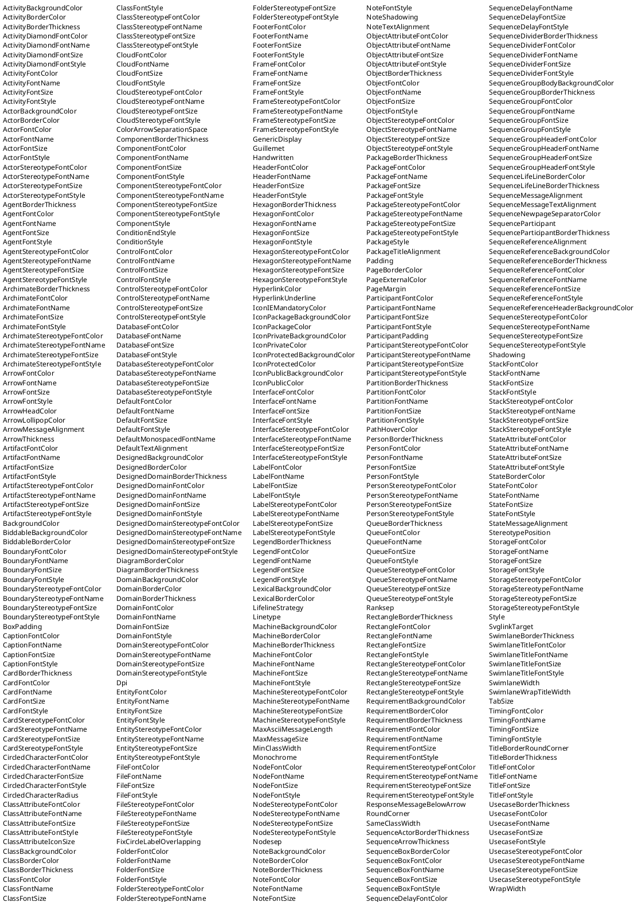

# Grokking PlantUML skinparams

[PlantUML](http://www.plantuml.com) has approximately a gazillion [skinparam](http://plantuml.com/skinparam) parameters
(this is a very large number, though still considerably smaller than a googol).
You can see them with [this code](http://www.plantuml.com/plantuml/uml/AyxEp2j8B4hCJIr9BIe60000):



## skinparam groups
Here we attempt to reduce the gazillion parameters to groups by using regexps:

    java -jar plantuml.jar -language > language.txt
    perl skinparam.pl language.txt |sort|uniq -c|sort -rn > skinparam.txt

The groupings are defined in `skinparam.pl`:

```
==group==          | ==regexp==
FONT               Font(Color|Name|Size|Style)
COLOR              (|Background|Border)Color
ARROW              Arrow(|Lollipop)(COLOR|FONT|Thickness)
ENTITY             (Agent|Archimate|Artifact|Boundary|Card|Cloud|Control|Database|DesignedDomain|Domain|Entity|File|Folder|Frame|Interface|Machine|Node(?!sep)|Queue|Rectangle|Requirement|Stack|Storage|Usecase)
layout-params      Dpi|MinClassWidth|SameClassWidth|Nodesep|Ranksep|(Box|Participant|)Padding|Linetype|SwimlaneWidth
link-params        HyperlinkCOLOR|HyperlinkUnderline|SvglinkTarget
text-params        DefaultMonospacedFONT|Guillemet|Handwritten|MaxAsciiMessageLength|MaxMessageSize|TabSize
alignment          ResponseMessageBelowArrow|(Default|Note|(Sequence|State)Message)TextAlignment|(Arrow|Package|Sequence|State)(Message|Reference|Title)Alignment
other-params       ^BackgroundColor|COLORArrowSeparationSpace|GenericDisplay|FixCircleLabelOverlapping|LifelineStrategy|PageMargin|(TitleBorder|)RoundCorner|SwimlaneWrapTitleWidth|(|Note)Shadowing|WrapWidth
attribute-params   (Class|Object|State)AttributeFONT
border-thickness   (ENTITY|Archimate|Activity|Class|Component|Diagram|Legend|Note|Object|Package|Partition|Sequence(Actor|Divider|Group|LifeLine|Participant|Reference)|Swimlane|Title|Usecase)BorderThickness
icon-params        Icon(IEMandatory|Package|Private|Protected|Public)COLOR|ClassAttributeIconSize|CircledCharacter(FONT|Radius)
color-params       (ENTITY|Actor|Designed|Biddable|Lexical|Activity(|Start|End|Bar|Diamond)|Class(|Header)|Collections|Component|Diagram|Enum|Generic|Interface|Note|Object|Package|Page|PageExternal|Participant|Partition|PathHover|Swimlane(|Title)|State(|Start|End|Bar)|Timing|Usecase(|Actor))COLOR
font-params        (ENTITY|Actor|Activity(|Diamond)|Class(|Header)|Collections|Component|Diagram|Enum|Generic|Interface|Note|Object|Package|PathHover|Participant|Partition|SwimlaneTitle|State|Timing|Usecase(|Actor))FONT
arrow-params       (ENTITY|Activity(|Diamond)|Class(|Header)|Collections|Diagram|Enum|Generic|Interface|Note|PathHover|Partition|Swimlane|State|Timing|Usecase(|Actor))ARROW
sequence-params    Sequence(|Actor|Box|Delay|Divider|Group(|Body|Header)|LifeLine|NewpageSeparator|Participant|Reference(|Header)|Title)(ARROW|COLOR|FONT)|SequenceParticipant
stereotype-font    (ENTITY|Actor|Class|Component|Interface|Object|Package|Participant|Sequence|Usecase(|Actor))StereotypeFONT
stereotype-params  Stereotype(Position|[ACEIN]COLOR)
style              (Component|Condition(|End)|Package|)Style
global-font/color  Monochrome|(Caption|Default|Footer|Header|Legend|Title)(FONT|COLOR)
```

Let's read the color-params group (there are 87 such):
- COLOR has the regex `(|Background|Border)Color`, which means the following params: `Color BackgroundColor BorderColor`
- color-params can set any of these COLOR params on the following:

ENTITY, which itself expands to these (`Node` but not `Nodesep`, which is a layout-param)

    Agent Archimate Artifact Boundary Card Cloud Control Database DesignedDomain Domain Entity 
    File Folder Frame Interface Machine Node Queue Rectangle Requirement Stack Storage Usecase

and further
 
    Actor Designed Biddable Lexical Activity ActivityStart ActivityEnd ActivityBar ActivityDiamond 
    Class ClassHeader Collections Component Diagram Enum Generic Interface Note Object 
    Package Page PageExternal Participant Partition PathHover Swimlane SwimlaneTitle 
    State StateStart StateEnd StateBar Timing Usecase UsecaseActor

This doesn't mean **each** of the COLOR params is applicable to each of these things. Eg let's check for "Activity":

```sh
grep "Activity.*Color" language.txt
ActivityBackgroundColor
ActivityBarColor
ActivityBorderColor
ActivityDiamondBackgroundColor
ActivityDiamondBorderColor
ActivityDiamondFontColor
ActivityEndColor
ActivityFontColor
ActivityStartColor
```

You see that `Activity` and `ActivityDiamond` have `Background` and `Border` color, while `ActivityBar` has a single color because it's solid.
But I preferred to use bigger groups that are easier to understand, even though they allow some non-existent combinations, 
rather than overly specific hard to grok groups.

Note: `ActivityFontColor ActivityDiamondFontColor` are grouped in `font-params` because `FONT` includes `FontColor`.

## group counts

The count of params per group is in `skinparam.txt`:

      144 font-params
      120 stereotype-font
       87 color-params
       43 sequence-params
       29 global-font/color
       26 border-thickness
       15 icon-params
       12 attribute-params
       11 stereotype-params
       11 other-params
       10 layout-params
        9 alignment
        7 ARROW
        6 text-params
        5 style
        3 link-params
        1 COLOR


## style evolution

The new "style" feature (see [style-evolution](http://plantuml.com/style-evolution)) will change that by using better modularization ala CSS.
You can enable it like this (already enabled for `wbs` and `mindmap` diagrams.

    skinparam useBetaStyle true
